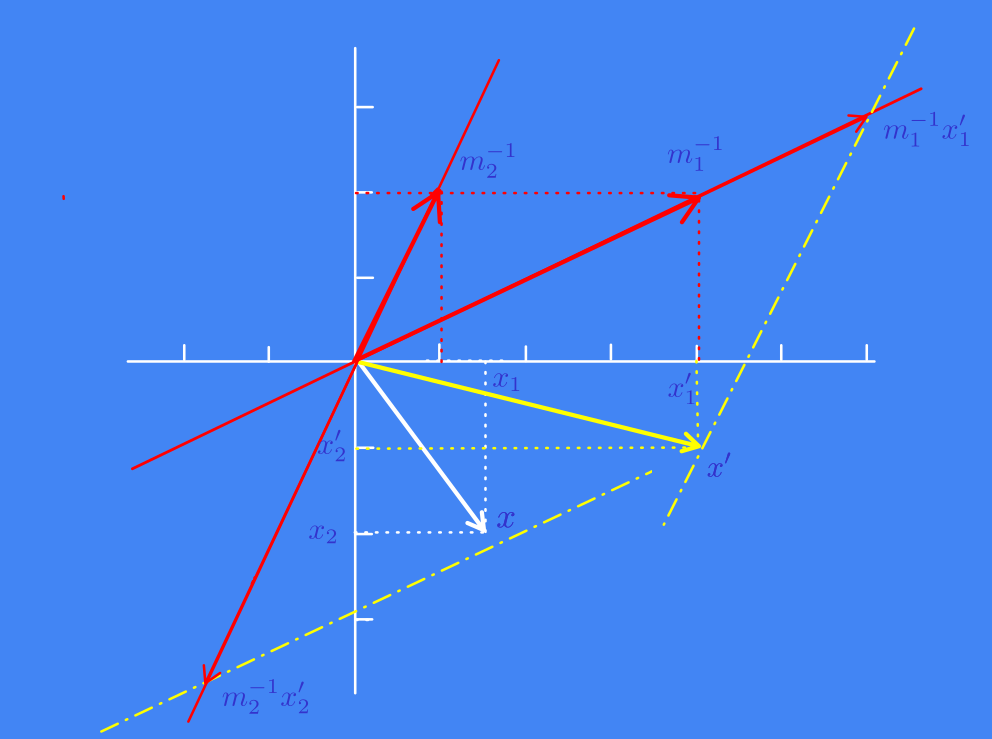

<link href="/home/cestien/memoria/template/nota_template/miestilo.css" rel="stylesheet"></link>

# Tópicos de repaso de matemática

## Algunas definiciones matemáticas
  - **Ensamble**: Un ensamble  es un triple $(X,\mathcal{X},\mathcal{P})$, donde la salida $X$ es el valor de una variable aleatoria, la cual toma uno de un conjunto de valores posibles $\mathcal{X} = \{x_1,x_2,\ldots,x_K\}$ con probabilidades $\mathcal{P} = \{p_1,p_2,\ldots,p_K\}$, y donde se cumple:
	- $P(X=x_k) = p_k$
	- $p_k \geq 0$
	- $\sum_{X \in \mathcal{X}} P(X) = 1$
  - **Ensamble conjunto**:  es un ensamble en el cual las variables aleatorias constituyen  un par ordenado $(X,Y)$, con
    $X\in \mathcal{X} = \{x_1,x_2,\ldots,x_I\}$
	y con $Y\in \mathcal{Y} = \{y_1,y_2,\ldots,y_J\}$. Llamamos $P(X=x_i,Y=y_j)$  a la probabilidad conjunta de $X$ e $Y$. 
  - **Información de Shannon**: $h(x)  =\log_2\frac{1}{P(x)}$
  - **Entropía de un ensamble $X$**: $H(X) = -\sum_{X\in \mathcal{X}} P(X)\log_2 {P(x)}$
  - Propiedades de la función entropía:
	  - $H(X) \geq 0$ con $H(X)=0$ si y solo si $p_i= 1$ para algun $i$
	  - $H(X) \leq \log \vert \mathcal{X}\vert$ con $H(x)= \log \vert \mathcal{X}\vert$ si y solo si $p_i=1/\vert\mathcal{X}\vert$ para todo $i$.
  - **Entropía conjunta:** $H(X,Y) = -\sum_{X,Y \in \mathcal{X}\mathcal{Y}} P(X,Y)\log P(X,Y)$
  - **Divergencia de Kullback-Leibler**: $D_{KL}(P\Vert Q) = \sum_{X\in \mathcal{X}} P(X)\log\frac{P(X)}{Q(X)}$
  - **Cross entropía** $H(P,Q) = -\sum_{\in \mathcal{X}}P(x)\log Q(x)$
  - **Información mutua** $I(X,Y) = D_{KL}\left(P(X,Y)\Vert P(X)P(Y)\right)$
  - **Desigualdad de Gibbs**: $D_{KL}(P\Vert Q) \geq 0$
  - **Desigualdad de Jensen**: Si $f$ es una función convexa y $x$ una variable aleatoria:
$\mathbb{E}[f(X)] \geq f\left(\mathbb{E}[X]\right)$
  - **Notación simplificada de la entropía**. Lo ejemplificamos para entropía pero se puede generalizar para todas las definiciones dadas. Las siguientes expresiones son equivalentes:
    - La más abstracta
      $$
      H(X) = -\sum_{X \in \mathcal{X}}P(X)\log P(X)
      $$
    - La más rigurosa
      $$   
      H(X) = -\sum_{k=1}^{K}P(X= x_k)\log P(X=x_k)
      $$
    - Las más usadas
      $$
      H(X) = -\sum_{k=1}^K P(x_k)\log P(x_k)
      $$
      $$
      H(X) = -\sum_x P(x)\log P(x)
      $$
  - **Distribución empírica de datos**. Dado un conjunto de $n$ observaciones i.i.d. $\mathcal{D}_n =\{(x_1,y_1), \cdots, (x_n,y_n)\}$ con $x_i\in \mathbb{R}^d$ e $y_i\in\{1,\cdots,K\}$, definimos la distribución empírica como:
  $$ 
  \tilde{P}(x,y) = \frac{1}{n}  \sum_{i=1}^n \mathbb{I}\{x=x_i,y=y_i\}
  $$
  - **Riesgo** Para una función de pérdida $L(\theta)$ que depende del problema a resolver.  
    - Riesgo funcional. También llamado riesgo verdadero, riesgo esperado o riesgo de Bayes 
    $$
    R(\theta) = \mathbb{E}_{\scriptscriptstyle P(x,y)} \{L(\theta)\}
    $$
    - Riesgo empírico.
    $$
    R_{emp}(\theta) =  \mathbb{E}_{\scriptscriptstyle \tilde{P}(x,y)} \{L(\theta)\}
    $$

 
## Notas de álgebra

### Definiciones básicas
A menos que se especifique lo contrario las matrices a utilizar serán de tipo  $A\in \mathbb{R}^{m\times n}$ con $m\geq n$. En general la matriz $A$ la llamamos matriz de datos donde las filas representan datos y las columnas parámetros. Por ejemplo, cada fila es un pixel de una imagen y cada columna sus componentes RGB, o cada fila es un frame de una señal y las columnas el valor de los coeficientes cepstrum.

#### Sobre el rango de una matriz
  - Matriz de rango completo. $A$ es de rango completo si cumple $\text{Rank}(A) = \min(m,n)$
  - Matriz de rango mínimo o de rango uno. Si $u\in \mathbb{R}^m$ y $v\in \mathbb{R}^n$, La matriz $A = uv^{\scriptscriptstyle T}$ es una matriz de rango $1$
  - Matriz de rango deficiente. $A$ es de rango deficiente si $\text{Rank}(A) < \min(m,n)$

#### Matrices ortogonales
  - Matrices cuadradas $P\in \mathbb{R}^{n\times n}$
    - $P$ es ortogonal $\iff$ $P^TP = I_n$ $\iff$ $PP^T=I_n$
    - Tanto sus filas como sus columnas forman bases ortonormales de $\mathbb{R}^n$
    - Es una isometría completa   (preserva todo y es invertible)
  - Matrices rectangulares $Q\in \mathbb{R}^{m\times n}$ con $m>n$
    - Si sus columnas son ortornormales, entonces $Q^TQ=I_n$
    - $Q$ es una isometría de $\mathbb{R}^n$ en $\mathbb{R}^m$, es decir preserva norma y producto escalar de lo que entra.

#### Matriz de proyección
  - Una matriz $P$ es una proyección ortogonal si y solo si cumple:
    - Idempotencia, es decir, $P=P^2$
    - Simetría, es decir, $P^T=P$
  - Propiedades
    - Siempre es una matriz cuadrada de la dimensión del espacio sobre el que actúa.
    - El rango de la matriz es siempre el de la dimensión del sub-espacio sobre el que proyecta, es decir $n$. O sea que $\text{Tr}(P)=n$. 
    - El determinanate de $P$ siempre es cero, a menos que $m=n$, es decir se proyecta sobre todo el espacio, en ese caso el determinante es uno y $P=I$. 
    

####  Matriz inversa, y pseudo-inversa
Dada una matriz $A\in \mathbb{R}^{m \times n}$ existen tres niveles de inversa 
  - **Matriz inversa**. Para el caso de matrices cuadradas, es decir $m=n$
    - $AA^{\scriptscriptstyle -1}= I$
    - $A^{\scriptscriptstyle -1}A= I$
  - **Matriz pseudo-inversa por izquierda**. Para el caso en que siendo $m>n$ es de rango completo, es decir, todas las columnas son linealmente independientes ($\text{Rank}(A)=n$).
    - $A^\dagger = (A^{\scriptscriptstyle T}A)^{-1}A^{\scriptscriptstyle T}$
    - $A^\dagger A = I_n$. Es decir la identidad se obtiene con la inversa del lado izquierdo.
    - $P = AA^\dagger$. Proyección sobre el espacio de las columnas.
  - **Matriz pseudo-inversa por derecha**. Para el caso en que siendo $m<n$ es de rango completo, es decir, todas las filas son linealmente independientes ($\text{Rank}(A)=m$).
    - $A^\dagger = A^{\scriptscriptstyle T}(AA^{\scriptscriptstyle T})^{-1}$
    - $P_f = A^\dagger A$ es una proyección sobre el espacio de las filas.
    - $P = AA^\dagger = I_m$. Es decir, la proyección sobre el espacio de las columnas es completa  y nos da la identidad.
  - **Matriz de pseudo-inversa de Moore-Penrose**. Para el caso más general en que $A$ no tiene restricciones de dimensión ni de rango
    - $A^\dagger = V\Sigma^\dagger U^{\scriptscriptstyle T}$. donde $\Sigma^\dagger$ es una matriz diagonal con la inversa de los valores singulares $1/\sigma_i$
    - $P_f = A^\dagger A$ es una proyección sobre el espacio de las filas
    - $P = AA^\dagger$ es una proyección sobreo el espacio de las columnas

#### Norma de Frobenius
  - Es la generalización de la norma euclidiana para matrices. Dada una matriz $A \in \mathbb{R}^{\scriptscriptstyle m\times n}$, se define como la raiz cuadrada de la suma de los cuadrados de los valores absolutos.  
  $$
  \Vert A \Vert_{\scriptscriptstyle F} = \sum_{i=1}^m\sum_{j=1}^n \vert a_{ij} \vert^{\scriptscriptstyle 2} = \sqrt{\text{Tr}(A^{\scriptscriptstyle T}A)}
  $$
  - Es una norma del espacio de Hilbert: Dadas dos matrices $A$ y $B$ ambas $\in \mathbb{R}^{\scriptscriptstyle m\times n}$
    $$
    \langle A,B \rangle_{\scriptscriptstyle F} = \text{Tr}(A^{\scriptscriptstyle T}B)
    $$

#### Matriz de centrado
La matriz de centrado $M$ es una matriz tal que al aplicarla sobre $A\in \mathbb{R}^{\scriptscriptstyle n\times n}$ produce $A_c = MA$ tal que la suma de las filas de $A_c$ son nulas, es decir que le resta a cada fila su correspondiente promedio. 
$$
M  = I_n -\frac{1}{n}\mathbf{1}\mathbf{1}^{\scriptscriptstyle T}
$$

### Cambio de base y transformaciones  lineales
Una matriz puede ser interpretada como:
  - Una matriz de cambio de base.
  - Una transformación lineal. 
#### Cambio de base
  - Supongamos una matriz $M\in\mathbb{R}^{n\times n}$ tal si $x$ son las coordenadas de un vector en la base canónica y, $x'$ son las coordenadas de un vector en otra base, decimos que $M$ es la matriz de cambio de base de $x$ a $x'$ y cumplirá: $x=Mx'$. 
  - Para que una matriz sea matriz de cambio de base solo se requiere que sea invertible, lo cual a su vez requiere que sus vectores columnas sean linealmente independientes.
  - si llamamos $m_i$ a los vectores columna de $M$ y asumimos que son linealmente independientes tendremos (para el caso $n=2$): $x = m_1x'_1 +m_2x_2'$.
  - Si llamamos $m^{-1}_i$ a los vectores columnas de $M^{-1}$ tendremos: $x' = m_1^{-1}x_1 +m_2^{-1}x_2$.
  - Ejemplo:
    $$
    x = \begin{pmatrix} 3/2\\ -2  \end{pmatrix}\;\;\;\;x' = \begin{pmatrix} 4\\ -1  \end{pmatrix}\;\;\;\;\;M = \begin{pmatrix}
    1/3 & -1/6 \\
    -1/3 & 2/3
    \end{pmatrix}\;\;\;\;\;M^{-1} = \begin{pmatrix}
    4 & 1 \\
    2 & 2
    \end{pmatrix}
    $$

    

    Observaciones:
      - Tanto los vectores $x$ como los vectores $x'$ están expresados en la base canónica
      - Lo mismo para los vectores $m_i$ y $m_i^{-1}$
      - Si queremos llegar al punto $x$ las instrucciones son: 
        - desplazarse $x_1$ unidades en la dirección del versor canónico $\hat{x}_1$
        - desplazarse $x_2$ unidades en la dirección del versor canónico $\hat{x}_2$. 
        - La unidad  en  ambas direcciones canónicas vale uno. 
      - Si queremos llegar al punto $x'$ las instrucciones son: 
        - desplazarse $x_1$ unidades en la dirección del vector $m_1^{-1}$
        - desplazarse $x_2$ unidades en la dirección del vector $m_2^{-1}$. 
        - La unidad en la dirección del  vector $m_1^{-1}$ es $\Vert m_1^{-1}\Vert$, y la unidad en la dirección del vector $m_2^{-1}$ es $\Vert m_2^{-1}\Vert$.
       - Los vectores $x$ y $x'$ son el mismo vector expresado en diferentes coordenadas. $M$ no mueve el vector, mueve el sistema de coordenadas rotándolo o deformándolo. Es como mirarse en un espejo normal y otro que deforma la imagen. 
#### Transformación lineal
- $V=\mathbb{R}^n$ es el espacio de partida o dominio 
- $W=\mathbb{R}^m$ espacio de llegada 
- $T:V\rightarrow W$ es una transformación lineal si cumple que cualquier combinación lineal de vectores de $V$ se convierten en una combinación lineal de las imágenes de dichos vectores en $W$. Es decir si $v = \alpha v1 + \beta v2$ entonces $T(v) = T(\alpha v1 + \beta v2)= \alpha T(v1) + \beta T(v2)$ 
- $\text{Im}(T) = \text{Col}(A)$. Podemos pensar a una matriz $A\in \mathbb{R}^{m\times n}$ como una transformación lineal si consideramos que los vectores columnas de dicha matriz son las imágenes en el espacio $W$ que corresponden a los vectores canónicos del espacio $V$. 
- Eg. $n=2$ y $m=3$,  $a_1 = T(\hat{v}_1)$ y $a_2 = T(\hat{v}_2)$.  En ese caso cualquier vector $x\in V$ se podrá escribir como  $x = \hat{v}_1x_1 + \hat{v}_2x_2$, y su correspondiente imagen $y\in W$  será $y=T(x) = T(\hat{v}_1x_1 + \hat{v}_2x_2)= x_1T(\hat{v}_1) + x_2T(\hat{v}_2) = x_1a_1 +x_2a_2 = Ax$.
- para el caso $m>n$ tendremos debido a que la dimensión del espacio de salida $V$ es menor que la del espacio $W$, y que la matriz tiene sus vectores columna linealmente independientes, las imágenes de $V$ van a vivir en un subespacio (un plano) de $W$ de dimensión $n$. Además la transformación es inyectiva, es decir, que cada vector de $V$ va a parar a un vector diferente de $W$. No es sobreyectiva, ya que todo el resto de $W$ que excluya el plano de imagen de $V$ no tiene una correspondiente pre-imagen en $V$.
- Observaciones:
    - La transformación lineal modifica el vector $x$ y lo convierte en el vector $y$ de modo que $y$ es una versión deformada de $x$ 
    - La transformación puede rotar, girar, aplastar un vector. A menos que $m=n$, esto ocurrirá siempre en diferentes espacios $\mathbb{R}^m$ y $\mathbb{R}^n$.
    - Si llamamos $\vec{a}_i\;\;\;i=1\cdots n$ a los vectores columnas de $A$ podremos expresar a $y$ como una combinación de los vectores columna de $A$, es  decir, 
    $$
    y = Ax = \sum_{i=1}^{n}\vec{a}_ix_i
    $$
    - En síntesis tenemos un vector $x \in \mathbb{R}^n$ en el espacio de entrada, con la matriz $A$ llevamos dicho vector a un sub-espacio del espacio de salida  $\mathbb{R}^m$. Dicho sub-espacio es  generado por $\text{col}(A)$. El nuevo vector $y \in \mathbb{R}^m$ vive en dicho sub-espacio columna. Ojo, no confundir $y$ es un vector del espacio $W = \mathbb{R}^m$, sin embargo, sus movimientos están limitados en dicho espacio al sub-espacio generado por los vectores columna de la matriz $A$

#### Transformaciones lineales isométricas e isomórfica
  - Una transformación lineal *isomórfica* es una transformación lineal biyectiva, es decir que no se pierde información al volver, es decir si $y=Vx$ existirá $V^{\scriptscriptstyle -1}$ tal que $x=V^{\scriptscriptstyle -1}y$. Consecuencia: Para ser isomórfica deberá $V$ cumplir: $V^{\scriptscriptstyle -1}V = VV^{\scriptscriptstyle -1} = I$
  - Una transformación lineal *isométrica*  es una transformación lineal que preserva el producto interior. Es decir, $T:V\rightarrow W$ es una isometría si para todo $u,v \in V$ se cumple: $\langle T(v),T(u) \rangle_{\scriptscriptstyle W} = \langle u,v \rangle_{\scriptscriptstyle V}$. Si utilizamos el producto interior $\langle u,v \rangle = u^{\scriptscriptstyle T}v$, tendremos $(Vu)^{\scriptscriptstyle T}Vv=u^{\scriptscriptstyle T}v$. Entonces tendremos que $V^{\scriptscriptstyle T}V = I$. Esto es equivalente a decir que los vectores columna de $V$ forman un conjunto ortonormal. 
  - Dependiendo de las dimensión de $V\in \mathbb{R}^{m \times n}$ tendremos:
    - Caso $m=n$: 
      - Si se cumple  $\text{det}(V)\neq 0$ entonces $V$ es un isomorfismo ya que el determinante distinto de cero me garantiza la existencia de la inversa.
      - Si se cumple que los vectores columna forman un conjunto ortonormal entonces también será una isometría ya que en ese caso $V^{\scriptscriptstyle T}V=I$
      - Observación: Si es una isometría también será un isomorfismo ya que por ser isometría tendrá que cumplirse que $V^{\scriptscriptstyle T}V=I$ y para ser isomorfismo deberá cumplirse $V^{\scriptscriptstyle -1}V = VV^{\scriptscriptstyle -1} = I$, lo cual está garantizado si $V$ es cuadrada.
    - Caso $m>n$:
      - No será nunca un isomorfismo ya que no es invertible por ser una matriz rectangular.
      - Si se cumple que los vectores columna forman un conjunto ortonormal entonces será una isometría ya que en ese caso $V^{\scriptscriptstyle T}V=I_n$
      - Observación. Nunca se cumplirá que   $VV^{\scriptscriptstyle T} = I$ ya que las filas no pueden formar un conjunto ortornormal ya que no podemos poner un espacio de dimensión $m$ en un espacio de dimensión $n$ por ser $m>n$.  $P = VV^{\scriptscriptstyle T}$ será la matriz de proyección de un vector en el espacio de dimensión $m$ sobre el plano formado por el sub-espacio de los vectores columna de dimensión $n$. Si $m=n$ la proyección será completa sin pérdida de información y tendremos $P=I$. 
      - Caso $m<n$. No será nunca ni una isometría ni un isomorfismo. 
  - Propiedades de la isometría. 
    - $\langle T(v),T(u) \rangle_{\scriptscriptstyle W} = \langle u,v \rangle_{\scriptscriptstyle V}$. Por lo tanto si $T()=V$, se cumplirá que $V^{\scriptscriptstyle T}V=I$
    - **Preservación de la norma (Energía)**. La norma de un vector se define como 
      $$\Vert v \Vert = \sqrt{\langle v,v \rangle}
      $$. 
      Entonces  se cumplirá que: $  \Vert T(v) \Vert=\Vert v \Vert$
    - **Preservación del ángulo**. El coseno del ángulo entre dos vectores se define como: 
      $$
      \cos \theta = \frac{\langle u,v\rangle}{\Vert u \Vert \Vert v \Vert}
      $$
      Al preservarse el numerador y el denominador también se preservará el ángulo
    - **Preservación de la distancia**. La distancia entre dos puntos se define como la norma de su diferencia
      $$
      d(u,v)= \Vert u-v \Vert
      $$

#### Cambio de base sobre transformaciones lineales
- sea $X\in V$ una matriz de cambio de base en el espacio $V$ y $W$ una matriz de cambio de base en el espacio $W$. de modo que $x=Xx'$ y $y=Yy'$.
- Si llamamos $A'$ a la matriz de la transformación lineal que corresponde a la nueva nueva base, es decir, es tal que: $y' = A'x'$. Dicha matriz se relaciona con la original por la siguiente expresión: 
$$
A'= Y^{-1}AX
$$

### Proyección de un vector sobre un sub-espacio
- Sea $A \in \mathbb{R}^{m \times n}$ con $m>n$  una matriz cuyos vectores columna son linealmente independientes, es decir $\text{col}(A) \subset \mathbb{R}^m$ y definen el sub-espacio de dimensión $n$ sobre el que se se va a proyectar un vector $b$
- $b\in \mathbb{R}^m$ es el vector a proyectar sobre el sub-espacio definido por $A$. 
- $p\in \mathbb{R}^m$ y $p\in \text{col}(A) \subset \mathbb{R}^m$ son las coordenadas del vector $b$ proyectado expresadas en la base canónica del espacio $\mathbb{R}^m$, 
- $p'\in \mathbb{R}^n$ es la representación de $p\in \mathbb{R}^m$ dentro del espacio de parámetros $\mathbb{R}^n$ cuya imagen bajo $A$ es $p\in \mathbb{R}^m$ s al cual se accede mediante $p=Ap'$.
- Es decir:
  - $b$ vive en $\mathbb{R}^m$ y se puede mover por todo el espacio
  - $p$ vive en el sub-espacio generado por $\text{col}(A)\subset \mathbb{R}^m$ o sea que está limitado a moverse en dicho sub-espacio.
  - $p'$ vive en  $\mathbb{R}^n$, otro mundo al que $p$ accede a través de $p=Ap'$.   
- El objetivo es encontrar un vector $p'$ que sea lo más parecido al vector $b$ en algún sentido. Dado que el vector $b$ vive en $\mathbb{R}^m$ y el vector $p'$ vive en vive en $\mathbb{R}^n$ no son comparables. Lo que hacemos es comparar $b$ con $p$ que sí viven en el mismo espacio y además sabemos que $p$ y $p'$ se relacionan entre si a través de $p=Ap'$.
- definimos el vector error $e=b-p$ como medida de la cercanía de $b$ con el sub-espacio generado por $\text{col}(A)$. Podemos pensar  que este error será mínimo haciendo dos interpretaciones:
  - Interpretación geométrica. El módulo del vector $e$ es lo más chico posible. Esto geométricamente ocurre cuando el mismo es ortogonal al sub-espacio generado por los vectores columna de $A$. 
  - Interpretación de energía. La energía del vector $e$ es mínima. 

#### Interpretación geométrica.
  - Para que el vector error sea ortogonal al subespacio de los vectores columna de $A$ debería cumplirse que el mismo sea perpendicular a cada una de las direcciones del dicho sub-espacio. 
  - lo que es equivalente a decir: $A^T(p-b)=0$, 
  - reemplazando $p=Ap'$ en $A^T(p-b)=0$ y operando se obtiene:
    $$
    p = A(A^TA)^{-1}A^T b =Pb
    $$ 
    la matriz $P \in \mathbb{R}^{m\times m}$ definida como $P=A(A^TA)^{-1}A^T$ la llamamos matriz de proyección del vector $b$ en el subespacio definido por $A$.
  - Algunas propiedades de $P$:
    - Es idempotente: $P^2=P$
    - Es simétrica
    - $\text{tr}(P)= \sum_{i=1}^n\lambda_i = \text{rank}(P)=n$ siempre, independientemente de que los vectores columna de $A$ sean ortogonales. 
    - Sus autovalores valen cero o uno. Uno para los autovectores dentro del sub-espacio de dimensión $n$  y 0 para los autovectores fuera de dicho espacio. Esto se deduce de la definición de autovector y autovalor y de la propiedad de idempotencia.
    - Todo vector $b\in \mathbb{R}^m$ se puede expresar como:
      $$
      b = Pb +(I-P)b
      $$
      El término $I-P$ es la matriz de proyección sobre el complemento ortogonal del sub-espacio original, donde el complemento ortogonal es un sub-espacio definido por todos los vectores ortogonales al sub-espacio original.
    - $P$ no es una matriz de cambio de base. $p = A(A^TA)^{-1}A^T b =Pb$, por lo que $P$ se podría interpretar como un operador lineal que *aplasta* el el espacio $\mathbb{R}^m$ sobre un sub-espacio de dimensión $\mathbb{R}^n$. No es una matriz de cambio de base porque esto solo ocurre si $m=n$, o sea dentro del mismo espacio.
    - Resumiendo:
      - Las ecuaciones normales $A^{\scriptscriptstyle T}(p-b)$ nos conducen a  $p=Pb$. Donde $P = A(A^TA)^{-1}A^T$ es un operador lineal que proyecta el vector $b$ sobre el subespacio generado por las columnas de la matriz $A$. Por lo tanto, $p\in\mathbb{R}^m$ son las coordenadas del vector proyección expresadas en la base canónica de $\mathbb{R}^m$.
      - $p = Ap'$. Donde $p' \in \mathbb{R}^n$  representa las coordenadas del mismo vector $p$, pero expresadas en la base de las columnas de $A$. Mientras que $p$ es el vector *físico* en el espacio grande, $p′$ es la "receta" o combinación lineal de las columnas de $A$ necesaria para llegar a él. 
  - Casos particulares:
    - Si $m=2$ y $n=1$ tendremos la proyección del vector $b$ de dos dimensiones en el sub espacio de dimensión $n=1$ definido por el vector $a\in \mathbb{R}^2$.  En ese caso el vector de proyección será:
      $$
      p = \frac{aa^{\scriptscriptstyle T}}{a^{\scriptscriptstyle T}a}b = Pb
      $$
      Donde 
      $$
      P =\frac{aa^{\scriptscriptstyle T}}{a^{\scriptscriptstyle T}a}
      $$
    - Si $A$ es una matriz de vectores ortonormales tendremos que $A^TA=I$, entonces $P$ se reduce a $P=AA^T$. En ese caso el vector de proyección se reduce a sumar las proyecciones individuales sobre cada columna:
    $$
    p = \sum_{i=1}^n(a^{\scriptscriptstyle T}_ib)a_i
    $$
  - Observación importante. No confundir matriz de transformación con matriz de proyección.
    - La matriz de transformación es una matriz de pasaje entre diferentes espacios, el espacio de entrada $V=\mathbb{R}^n$ y el espacio de salida  $W=\mathbb{R}^m$. Si un vector $x \in V$ es transformado mediante $y=Ax$ en un vector $y$, al ser $x$ de dimensión menor su correspondiente $y$, si bien tiene dimensión $m$, los movimientos que puede hacer quedarán restringidos a un sub-espacio. Dicho sub-espacio es el generado por los vectores columna de $A$. O sea, no hay ninguna pérdida de información en el pasaje y podríamos volver haciendo $x=A^{\dagger}y$
    - La matriz de proyección $P$ también es una transformación, pero su función es restringir los movimientos posibles de un vector $b\in \mathbb{R}^m$ al sub-espacio de los vectores columna de $A$ pero siempre dentro del mismo espacio $\mathbb{R}^m$. El vector que vive en ese sub-espacio lo llamamos vector proyectado $p\in \mathbb{R}^m$. Si ahora aplicamos la matriz de transformación $A^{\dagger}$ obtendremos el vector transformado en el espacio $\mathbb{R}^{n}$. Si llamamos $p'$ a dicho vector tendremos $p'= A^{\dagger}p$. En este caso no hay pérdida de información, es decir, podríamos volver a obtener $p$ a partir de $p'$ haciendo $p=Ap'$. Lo que no es posible es volver al vector original $b$ ya que en el proceso de convertir $p$ en $b$ se perdió información.

#### Interpretación de energía
  - Se basa en minimizar la energía del error, es decir minimizar la función
  $$
  f(p) = {\Vert e \Vert}^2 = (b-p)^{\scriptscriptstyle T}(b-p)=(b-Ap')^{\scriptscriptstyle T}(b-Ap') 
  $$ 
  - Haciendo $\nabla_{p'} f(p')=0$ encontramos que el mínimo de $p'$ se produce cuando:
  $$ 
  p' = (A^{\scriptscriptstyle T}A)^{\scriptscriptstyle -1}A^{\scriptscriptstyle T}b = A^{\dagger}b
  $$

### Autovalores y autovectores
  - Un autovector de una matriz $A\in \mathbb{R}^{n\times n}$  es un vector $v$ tal que al ser transformado por la matriz $A$ no cambia su dirección, solo se estira o encoge en un factor de escala $\lambda$ llamado autovalor. Entonces se cumplirá que: $Av=\lambda v$
  - El proceso para encontrar  autovalores y autovectores de $A$ consiste en resolver la ecuación: $(A-\lambda I) = 0$
  - Si la cantidad de autovectores linealmente independientes que encontramos es igual a la dimensión de $A$, diremos que la matriz es diagonalizable, y el proceso de encontrar los $n$ autovectores y $n$ autovalores lo llamamos diagonalización.
  - Si llamamos $P$ a la matriz formada por los autovectores en columna y $D$ a una matriz diagonal con los autovalores en la diagonal principal, la diagonalización deberá encontrar $P$ y $D$ tal que:
  $$
  AP = PD \implies A = PDP^{-1} \implies D=P^{-1}AP
  $$
  - La ventaja de $y'=Dx'$ donde $x=Px'$ e $y=Py'$  por sobre $y = Ax$ es que cada componente de $y$ depende de todas las componentes de $x$ en cambio cada componente de $y'$ solo depende de la correspondiente correspondiente $x'$ y del correspondiente autovalor. Es decir, al considerar al vector en la base de autovectores la relación, en dicha base, el efecto que produce la transformación $A$ es simplemente la de estirar o acortar las coordenadas del vector original ($x'$) resultando el vector $y'$ que simplemente es un escalamiento por los autovalores de las coordenadas de $x'$. 
  - Físicamente los autovectores representan:
    - Los ejes naturales de la matriz.
    - La dirección de mayor estiramiento en la dirección del autovalor mayor
    - Las direcciones de los autovectores son invariantes. No cambian con la transformación $A$ solo se achican o agrandan.
  - El efecto que produce la matriz $A$ sobre $x$ hará que:
    - Si un autovalor es mayor que todos los demás el vector $y$ tenderá a estar cerca de la dirección del correspondiente autovector.
    - Si los autovalores son todos similares los $y$ serán una versión escalada de $x$ en la misma dirección
    - Si los autovalores son todos uno $y$ será igual a $x$.
  - Observaciones:
     - La transformación en la base de autovectores $D=P^{-1}AP$  producirá entonces dos efectos:
      - Desacoplar las variales. Las componentes de $y'$ solo dependeran de su correspondiente componente en $x'$ y del autovalor.Esto también tiene la ventaja de que al poder mirar los componentes desacoplados podemos ver cual tiene mayor importancia frente a los otros. 
      - Descorrelacionar las variables. Ya que las componentes de $y'$ quedan *descorrelacionados*  de $x'$ porque no existiran interdependencias. 
     - En la transformación con autovectores no se busca explícitamente la descorrelación, lo que se busca es desacoplar todas las variables.
  - Ejemplo:
    

### Matrices simétricas, matrices definidas positiva y matriz de Gram
  - Matriz simétrica $A=A^T$
  - Matriz definida positiva: Todos los autovalores son $>0$. 
  - Toda matriz definida positiva es simétrica. No toda matriz simétrica es definida positiva (puede ser simétrica y tener autovalores negativos)
  - Teorema espectral. Si $A$ es una matriz es simétrica:
    - Los autovalores siempre serán reales.
    - Los autovectores serán perpendiculares (no necesariamente ortonormales)
    - Si llamamos $Q$ a la matriz de autovectores normalizadas (es decir, $Q$ ortogonal) tendremos que $A$ se podrá expresar como:
    $$
    A = QDQ^T = \sum_{i=1}^{n}\lambda_iq_iq_i^{\scriptscriptstyle T}
    $$
      - **Recordar esta propiedad.** Si $a_k$ son las columnas de una matriz $A$ de tamaño $(m\times k)$ y $b_k$ son las filas de otra matriz $B$ de tamaño $(k \times n)$, entonces: 
      $$
      AB = \sum_{i=1}^k a_ib_i^{\scriptscriptstyle T}
      $$
    - Poseen siempre una forma cuadrática asociada $f(x)=x^TAx$
  - Diagonalización. Si queremos diagonalizar una matriz simétrica tenemos garantizado que los autovectores son ortogonales entre sí pero no ortonormales. Entonces para que la matriz de autovectores sea ortogonal, es decir, $P^{-1}=P^T$ tendremos que normalizar previamente los autovectores  y entonces podremos hacer: $A = PDP^T$. Si no normalizamos la diagonalización tendríamos que hacerla haciendo $A = PDP^{-1}$. Si hacemos esto tendremos que $\Vert x \Vert = \Vert x' \Vert$ y además  $\Vert y \Vert = \Vert y' \Vert$. Es decir la normalización me asegura que el cambio de base dado por $P$ mantenga la misma escala y no modifique el espacio ni de $x$ ni de $y$. La única diferencia que tendremos entre $y'$ y $x´$ vendrá dada por el valor de los autovalores.
  - Un cambio de base sobre  una base ortogonal produce una rotación y un estiramiento y un acortamiento de los ejes, por ejemplo si tengo una elipse en una base y hago un cambio de base con una matriz de autovectores ortogonales (con autovalores $>0$) obtengo una elipse rotada y deformada. En cambio si la base es además ortonormal obtengo la misma elipse en otros ejes.
  - Resumiendo
    - Matriz simétrica $\implies$
      - $A=A^T$
      - Autovalores reales (positivos o negativos)
      - Autovectores perpendiculares (no necesariamente ortonormales)
      - Forma cuadrática asociada $f(x)=x^TAx$
    - Matriz definida (semidefinida positiva) $\implies$
      - Autovalores $>0$ ($\geq 0$)
      - $A=A^T$
  - Matriz de Gram. Dado $A\in \mathbb{R}^{m\times n}$ llamamos matriz de Gram $M\in \mathbb{R}^{n\times n}$ asociada a $A$ a $M=A^TA$ y tiene las siguientes propiedades:
    - Siempre es simétrica independientemente de como sea $A$, por lo tanto tendrá sus autovalores reales, y autovectores ortogonales (teorema espectral)
    - siempre es cuadrada
    - semi-definida  positiva
    - Dado que $M_{ij} = a_i a_j$ (columnas de $A$):
      - Los elementos de la diagonal serán las normas del cuadrado  de la columnas $\Vert a_i \Vert^2$
      - Los elementos fuera de la diagonal nos dicen que tan parecidas o correlacionadas están las columnas entre si.
  - Matriz de similitud. En la matriz de Gram comparamos  las columnas entre sí, cada elemento $m_{ij}$ es un producto interior entre la columna $i$ y la columna $j$ de $A$. La matriz de similitud se define como $S=AA^{\scriptscriptstyle T}$. Esta matriz realaciona la filas de $A$. Cada elemento $s_{ij}$ es el producto interior de la fila $i$ con la fila $j$ de $A$. Si $A$ es una matriz de datos la matriz de similitud compara los diferentes datos entre si.
  
### Formas cuadráticas
  - La forma cuadrática es una función $f:\mathbb{R}^n\rightarrow\mathbb{R}$ definida por términos que son polinomios de segundo grado y que tiene la forma: 
    $$
    f(x) = \sum_{i,j=1}^n a_{ij}x_ix_j = x^TAx
    $$
    - $A$ siempre es cuadrada y simétrica
    - Si $A$ es definida positiva $f(x)>0$
    - Si $A$ es semi-definida positiva $f(x)\geq 0$
    - Si $A$ es definida negativa $f(x)<0$
  - Cociente de Rayleigh. Dada una matriz real y simétrica $M$, para cualquier vector $x\neq 0$, el cociente de Rayleigh se define como: 
        $$R(M,x)=\frac{x^{\scriptscriptstyle T}Mx}{x^{\scriptscriptstyle T}x}$$
    - Teorema de Rayleigh. El cociente de Rayleigh se mantiene entre el autovalor más pequeño y el más grande:
      $$
      \lambda_{min} \leq \frac{x^{\scriptscriptstyle T}Mx}{x^{\scriptscriptstyle T}x}< \lambda_{max}
      $$ 
    - La maximización de la forma cuadrática $f(x)  = x^{\scriptscriptstyle T}Mx$ sujeta a la restricción que $x^{\scriptscriptstyle T}x=1$ conduce a que $Mx=\lambda x$, por lo que reemplazando obtenemos $f(x)=\lambda$. Con lo cual inferimos que los puntos críticos (máximos, mínimos y sillas) de $f(x)$ se producen en las direcciones de los autovectores de $M$ y que el valor máximo de $f(x)$ es el valor del máximo autovalor. Esto se demuestra planteando
      $$
      \mathcal{L}(x,\lambda) = x^{\scriptscriptstyle T}Mx - \lambda(x^{\scriptscriptstyle T}x-1)
      $$

      y recordando que: 
      $$
      \begin{align}
      \frac{\partial(x^{\scriptscriptstyle T}Mx)}{\partial x} &= 2Mx \\ \\ \frac{\partial(x^{\scriptscriptstyle T}x)}{\partial x} &= 2\lambda x
      \end{align}
      $$ 
    - Observación muy importante: El teorema exige que $M$ sea simétrica lo cual exige autovectores ortogonales. Con eso me aseguro que las imágenes de $M$ se agrupan en la dirección de autovectores. Si no fuese cuadrada no existen autovectores, pero si es cuadrada no simétrica existen autovectores pero en ese caso NO serán las direcciones preferenciales de agrupamiento. En resumen el concepto de que los autovectores son direcciones preferenciales es solamente válido para matrices cuadradas y simétricas.
 
### Descomposición en valores singulares
Si la matriz $A\in \mathbb{R}^{m \times n}$  representa una transformación entre un espacio de entrada de dimensión $n$ y un espacio de salida de dimensión $m$. Acá no tiene sentido hablar de autovalores y autovectores ya que $A$ debe ser cuadrada. Intuitivamente si decimos que $y'=A'x'$ mantiene la dirección de $x'$ (haciendo que solo varíen en un factor de escala) no tendría sentido comparar direcciones ya que los espacios tienen diferente dimensión. Tampoco tendría sentido hablar de desacoplar variables. La idea de la transformación con valores singulares es la siguiente, en el caso de matrices de transformación cuadradas al hacer $y=Ax$ el vector $y$ será *empujado* por la transformación en direcciones preferenciales dadas por las direcciones de los autovectores cuyos autovalores sean más grandes. En el caso de espacios de distinta dimensión seguirán existiendo esas direcciones preferenciales, pero ya no serán los autovectores de mayor autovalor ya que no existe tal cosa. La idea es encontrar dichas direcciones en las dimensiones que persistan después de la transformación.
#### Definición de SVD
La transformación en valores singulares se define como: $A = U\Sigma V^T$. Donde:
  -  $V\in \mathbb{R}^{n\times n}$ es una matriz de cambio de base ortogonal (vectores perpendiculares y normalizados) que se encuentra en el espacio de entrada, sus columnas se llaman vectores singulares derechos del espacio original 
  - $U\in \mathbb{R}^{m\times m}$ es una matriz también ortogonal, de cambio de base en el espacio de salida. Sus columnas se llaman vectores singulares izquierdos del espacio transformado por $A$.
  - $\Sigma\in \mathbb{R}^{m \times n}$. Es una matriz con valores en la diagonal principal $\sigma_1 \geq \sigma_2 \geq \cdots \geq 0$ llamados valores singulares.
  - Observación: si escribimos $AV=U\Sigma$, tenemos que las columnas de $V$ actúan sobre la derecha de la matriz $A$ por eso a los vectores columnas de $V$ se lo llama vectores singulares derechos. Análogamente, las columnas de $U$ actúan sobre la izquierda de la matriz $\Sigma$ por eso a los vectores columnas de $U$ se lo llama vectores singulares izquierdos.
  - En resumen la descomposición en valores singulares es un doble cambio de base y una transformación diagonal.
    - la matriz $V$ es una matriz ortogonal con lo cual la entrada $x'=V^{\scriptscriptstyle T}x$ define las coordenadas de $x$ en la base ortogonal, pero siempre en el mismo espacio $\mathbb{R}^n$
    - Luego se  mapea el vector $x'$  en el espacio  $\mathbb{R}^m$ haciendo $y'=\Sigma x'$.
    - Finalmente se realiza un cambio de base sobre el vector  $y'$ usando la base ortogonal formada por las columnas de la matriz $U$ haciendo $y=Uy'$. 
#### Matriz de Gram asociada a $A$
La matriz de Gram $M=A^{\scriptscriptstyle T}A$ asociada a $A$ posee las siguientes propiedades:
  - Los  vectores columnas de $U$ son los autovectores de $M^T$
  - Los vectores columna de $V$ son los autovectores de $M$
  - Los valores singulares de $\sigma_i$ son la raiz cuadrada de los autovalores de $M$  
  - La forma cuadrática $g(x) = x^{\scriptscriptstyle T}Mx$ asociada a $M$ es: $g(x) = \Vert y \Vert ^2$ donde $y=Ax$.
##### Direcciones preferenciales de $A$
Dado que:
  - Por el teorema de Rayleigh $g(x)$ es máxima cuando $x$ sea un autovector de $M$ y $\lambda_{max}$ será el valor de dicho máximo. 
  - Y dado también que $g(x)= \Vert y \Vert ^2$
  - Tendremos que al encontrar los autovectores de $M$ estaremos encontrando las direcciones donde el mapeo $A$ produce el máximo módulo del vector $x$ transformado. Por lo que estas direcciones también serán preferenciales para $A$ en el sentido dirigir al vector transformado hacia las direcciones de máxima energía.
  - Si la entrada $x$ es el autovector $v_i$ de $M$ entonces el correspondiente $y=Ax$ tendrá una longitud igual al valor singular $\sigma_i$ correspondiente.
  - Conclusión:
    - Rayleigh te dice que el valor máximo de la forma cuadrática asociada a $M$ es $\lambda_{max}$
    - Además encontramos que la forma cuadrática asociada a $M$ es $g(x)=\Vert y \Vert^2=\Vert Ax \Vert^2$
    - Por consiguiente $\Vert Ax \Vert^2=\lambda_{max}$
    - Y, como $\lambda_i=\sigma^2_i$ tenemos que $\Vert Ax \Vert=\sigma_{max}$
  Si quisieramos hallar la segunda dirección preferencial asumiendo que $v_1$ es la primera tendríamos que pedir que $x^Tv_1=0$. De esta manera estaríamos mandando al espacio $W$ solamente aquellos $x$ que sean ortogonales a $v_1$ que se lleva los puntos de mayor energía pero deja todo el resto para que podamos encontrar el segundo máximo. Para esto hacemos:
      - Maximizar $x^{\scriptscriptstyle T}Mx$
      - Sujeto a $\Vert x \Vert = 1$
      - $x^{\scriptscriptstyle T}v_1 = 0$
#### Matriz de proyección asociada a los autovectores de $V$
$V_k \in \mathbb{R}^{n\times k}$ Es una matriz cuyos vectores columna corresponden  los $k$ autovectores de $V$ de mayor energía. Es decir que las columnas de $V_k$ forman una base de un sub-espacio de $\mathbb{R}^n$.

#### Aplicación de SVD: Análisis de componentes principales (PCA)
  - $A$ es una matriz de datos, es decir, una matriz en la que cada fila es un dato y en el que cada columna es una componente o feature de ese dato. Generalmente se resta la media
  - $M$ es la matriz de Gram de la matriz de datos, es decir,  $M=A^{\scriptscriptstyle T}A$ además es la matriz  de covarianza.
  - Llamamos componentes principales  a las direcciones donde se produce el principal estiramiento de los datos, o donde se concentra la mayor parte de la energía de los datos. Estos se calculan de dos modos:
    - Usando Rayleigh. 
      - Encontramos la dirección $v_1$ que maximiza $f(x)=x^{\scriptscriptstyle T}Mx$ ($M=A^TA$) con lo que obtenemos la dirección del autovector asociado a $\lambda_{max}$. Este es el primer componente principal. Es el eje de mayor estiramiento donde los datos tienen la máxima longitud $\Vert Ax \Vert = \sigma_1 = \sqrt{\lambda_{max}}$
      - Basados en el teorema espectral 
        $$
        M = V\Sigma V^{\scriptscriptstyle T} = \sum_{i=1}^{m}\lambda_iv_iv_i^{\scriptscriptstyle T}
        $$
        Si restamos definiendo  $M_2 = M - \lambda_1v_1v_1^{\scriptscriptstyle T}$ obtenemos una matriz cuya proyección en el autovector $v_1$ es nula por lo tanto el si usamos Rayleigh encontramos $v_2$ que es  la dirección de máximo estiramiento en ese sub-espacio y la segunda mayor cantidad de energía  $\Vert Ax \Vert^2 = \sigma_1^2 = \lambda_{max}$
      - Procedemos de esa manera hasta que por ejemplo:
        $$
        \frac{\sigma_1^{\scriptscriptstyle 2}+\sigma_2^{\scriptscriptstyle 2}}{\sum_{i=1}^m\sigma_i^{\scriptscriptstyle 2}} > 0.95
        $$
    - Usando directamente SVD:
      - Reemplazando la descomposición en valores singulares de $A = U\Sigma V^{\scriptscriptstyle T}$. Tendremos que $M=A^{\scriptscriptstyle T}A= (U\Sigma V^{\scriptscriptstyle T})^{\scriptscriptstyle T} (U\Sigma V^{\scriptscriptstyle T})= V\Sigma^{\scriptscriptstyle T}\Sigma V^{\scriptscriptstyle T}$. 
      - Esto nos dice que si diagonalizamos $M$ sus autovectores son los $V$ de la descomposición en valores singulares y su matriz de autovalores será: $D= \Sigma^{\scriptscriptstyle T}\Sigma$ es decir, los valores singulares al cuadrado $\lambda_i=\sigma_i^{\scriptscriptstyle 2}$.
      - Obtener los valores principales se reduce entonces a hacer la descomposición en valores singulares de la matriz de datos $A$ y elegir los vectores $v_i$ que tengan los mayores $\sigma_i$. 
  - Ejemplo: Supongamos que $A\in \mathbb{R} ^{n\times n}$ es una imagen donde cada componente $a_{ij}$ representa un pixel de la misma. 
    - Podemos pensar que cada una de las $n$ filas de la matriz representa un punto en un espacio de $n$ dimensiones cuyas coordenadas  son los vectores columna de $A$.   
    - Hacemos una descomposición de valores singulares de $A$ y nos quedamos con los dos primeros, es decir, formamos $U_2$, $\Sigma_2$ y $V_2$. El sub-espacio generado por $v_1$ y $v_2$, será un plano en el espacio de dimensión $n$ (columnas de $A$). 
     - Si proyectamos cada uno de los vectores columna de $A$ en el sub-espacio tendremos que las coordenadas del vector proyectado $\hat{a}_i$  serán $\hat{a}_i=Pa_i$ donde $P$ es la matriz de proyección de un vector cualquiera sobre un sub-espacio. En nuestro caso dado que el sub-espacio es ortogonal se reduce a: $P=V_2V_2^T$.
     -  Finalmente, si llamamos $\hat{A}$ a la matriz proyectada, formadda por las columnas de $\hat{a}_i$ tendremos: $\hat{A}=AP$. Dicha matriz representa la imagen original $A$ filtrada por la descomposición usando las componentes de mayor energía.

### Descomposición QR y descomposición de Cholesky
  - Descomposición QR: Sea una matriz real $A\in \mathbb{R}^{\scriptscriptstyle m\times n}$ con $m\geq n$, existe una desomposición 
    $$
    A = QR
    $$
    donde:
      - $Q\in \mathbb{R}^{\scriptscriptstyle n\times n}$ es una matriz ortogonal $Q^{\scriptscriptstyle T}Q=I$. Geométricamente representa una base ortonormal para el espacio de las columnas de $A$
      - $R\in \mathbb{R}^{\scriptscriptstyle m\times m}$, es una matriz triangular superior $r_{\scriptscriptstyle ij}$ para $i>j$ contiene las proyecciones de las columnas de $A$ sobre la base $Q$ y captura la correlación entre las variables originales.
    
    El método de cálculo de la descomposición (uno de ellos) es la descomposción de Gram-Schmid que se basa en la ortogonalización iterativa de las columnas. 
  - Descomposición de Cholesky: Sea $A\in \mathbb{R}^{\scriptscriptstyle n\times n}$ una matriz simétrica y definida positiva, existe una matriz triangular $L\in \mathbb{R}^{\scriptscriptstyle n\times n}$ con elementos diagonales positivos tal que
    $$
    A=LL^{\scriptscriptstyle T}
    $$
    $L$ es una matriz triangular inferior $l_{\scriptscriptstyle ij}=0$ para $i<j$
  - Relación entre ambas: Si $X=QR$ entonces la matriz de Gram $A=X^{\scriptscriptstyle T}X$ cumple
    $$
    L = R^{\scriptscriptstyle T}
    $$

### Matriz raiz cuadrada
$A^{\scriptscriptstyle 1/2}$ es la raiz cuadrada de $A$ si $A= A^{\scriptscriptstyle 1/2}A^{\scriptscriptstyle 1/2}$. Si $A$ es simétrica por el teorema espectral $A=Q\Lambda Q^{\scriptscriptstyle T}$, entonces $A^{\scriptscriptstyle 1/2}=Q\Lambda^{\scriptscriptstyle 1/2}Q^{\scriptscriptstyle T}$.
  
### Ampliación de algunos conceptos
#### La matriz de datos $A$
  - Cuando decimos que un vector vive en un espacio de dimensión $n$ significa que tiene $n$ componentes. Entonces el espacio de los datos contendrá $m$ elementos (vectores) que son las filas de $A$ y cada uno de esos elementos tiene dimensión $n$. El espacio de las columnas es el espacio de las features, como tenemos $n$ features tendremos $n$ elementos. Cada elemento tiene $m$  componentes que representan para esa feature el valor que tiene para cada dato. 
  - La matriz de datos la podemos pensar como: 
    - Un conjunto de $m$ observaciones que viven en el espacio de las features $\mathbb{R}^n$ 
    - Un conjunto de $n$ features que viven en el espacio de las observaciones $\mathbb{R}^m$.
  - Formalmente;
    - $\mathcal{V}=\mathbb{R}^n$  es el espacio de entrada o el espacio donde viven las observaciones.
    - $\mathcal{W}=\mathbb{R}^m$  es el espacio de salida o el espacio donde viven las features
    - $A:\mathbb{R}^{\scriptscriptstyle n}\rightarrow\mathbb{R}^{\scriptscriptstyle m}$ es la matriz de transformación o mapeo del espacio de entrada al de salida.

#### Relación entre diagonolizacón y SVD
Todo lo que digamos es para una matriz de transformación $A\in \mathbb{R}^{\scriptscriptstyle m\times n}$ con $m\geq n$, real y si $m=n$ también simétrica, es decir con autovectores ortogonales. Asumimos también para simplificar que $\Vert x\Vert=1$. Es decir que la energía de la entrada es unitaria. 
  - Caso $m=n$. En este caso $y=Ax$ mantiene al vector de salida $y$ en el mismo espacio que el vector de entrada $x$, entonces tiene sentido comparar como quedan las respectivas direcciones y módulos de ambos.  
    - Un autovector de $A$ es cualquier vector tal que al trasformarlo con $A$ mantiene su dirección, y solo cambia su escala. Es decir, se puede estirar comprimir o cambiar de sentido pero siempre manteniendo la dirección original. 
    - Interpretación algebraica del autovalor. El autovalor  me dice justamente cual es ese factor de escala que modifica el vector de entrada cuando es un autovector. 
    - Interpretación física del autovalor. Todo  vector $y$ estará acotado en energía por el máximo autovalor de la matriz de Gram, es decir, $\Vert y\Vert^{\scriptscriptstyle 2}\leq \lambda_{\scriptscriptstyle \max}(M)=\lambda_{\scriptscriptstyle \max}(A)^2=\sigma_1^2$. Esto sale de:
      - i) ${\Vert y\Vert}^{\scriptscriptstyle 2} = (Ax)^{\scriptscriptstyle T}(Ax)=x^{\scriptscriptstyle T}(A^{\scriptscriptstyle T}A)x=x^{\scriptscriptstyle T}Mx$. 
      - ii) Haciendo la derivada igual a $0$ sde esta función sujeta a $\Vert x \Vert=1$ obtenemos $f(x_0) = L_0$, donde $L_0$ es el multiplicador de Lagrange. 
      - iii) Por otro lado si $x_0$ fuera un autovector de $M$ tendríamos que $f(x_0)= x_0^{\scriptscriptstyle T}Mx_0= x_0^{\scriptscriptstyle T}\lambda_0x_0 = \lambda_0$.
      - iv) Entonces, los puntos críticos de $f(x)$ son iguales a los autovalores. Por lo que el máximo de la función corresponderá a $\lambda_{max}$ y el mínimo a $\lambda_{min}$.
      - v) y dado que $M=A^TA=(PDP^T)^T(PDP^T) = P(D^TD)P^T$, tendremos que  los autovectores de $M$ son iguales a los de $A$ y los autovalores cumplirán: $\lambda_M = \lambda^{\scriptscriptstyle 2}_A$.
    - La transformación $A=P\Lambda P^{\scriptscriptstyle T}$, se puede interpretar como una cascada de tres operaciones, dado que $A$ es simétrica, $P$ es ortogonal(teorema espectral):
      1. Un cambio de base tal que $x'=P^{\scriptscriptstyle T}x$. Su función es cambiar las coordenadas del vector de modo de descomponer el mismo en la base de autovectores. 
      2. Una transformación lineal cuya matriz de transformación es $y'=\Lambda x'$. Una vez que el vector está expresado en las direcciones de los autovectores esta transformación es solamente un cambio de escala dado por los autovalores.
      3. Un cambio de base $y=Py'$. Su función es reestablecer las coordenadas originales.
    Esta cascada demuestra que una matriz simétrica no tuerce el espacio de forma arbitraria sino que simplemente lo estira y lo encoge a lo largo de sus direcciones naturales
  - Caso $m>n$. En este caso los espacios de salida y de entrada tienen diferente dimensión, sin embargo, la lógica de la cascada se mantiene casi idéntica, solo que ahora es más flexible En este caso la matriz $A$ se puede descomponer como: $A=V\Sigma U^{\scriptscriptstyle T}$ y tendremos:
      1. Un cambio de base tal que $x'=V^{\scriptscriptstyle T}x$. Su función es cambiar las coordenadas del vector de modo de descomponer el mismo en la base de autovectores de $V$ llamados **vectores singulares de entrada**. Esta rotación alinea los autovectores con las direcciones de máxima energía (autovectores de la matriz de Gram). 
      2. Una transformación lineal cuya matriz de transformación es $\Sigma$ tal que  $y'=\Sigma x'$. Una vez que el vector está expresado en las direcciones de los autovectores esta transformación estira cada componente por su valor singular $\sigma_i$.
      3. Un cambio de base $y=Uy'$. A diferencia del caso simétrico, el vector resultante no vuelve a la base original con $V$ (obviamente porque $V$ viven en otro espacio), sino que se expresa en una nueva base $U$. Estos son los **vectores singulares de salida**, que representan los ejes del elipsoide en el espacio de llegada.
  - En ambos casos (diagonalización y SVD) aprovechamos el hecho de que la matriz de Gram $M$ es simétrica y real. Obtenemos sus autovectores y autovalores: los autovectores apuntan en las direcciones donde la energía de salida es máxima y los autovalores representan esa energía máxima $\Vert y\Vert^{\scriptscriptstyle 2}$. Tanto en diagonalización como en SVD, los autovectores de entrada coinciden con los de $M$. La relación clave es que los autovalores de la matriz de Gram son el cuadrado de los autovalores de la matriz original, lo que equivale a decir que el estiramiento o valor singular es el valor absoluto del autovalor, es decir, $\sigma=\vert\lambda_A \vert$.
  - Si $A$ es cuadrada ($m=n$) pero no simétrica, su matriz de autovectores no será ortogonal; esto significa que el espacio se tuerce. Sin embargo la matriz de Gram $M=A^{\scriptscriptstyle T}A$ siempre es simétrica y sus autovectores ortonormales.  Por lo tanto las direcciones de los autovectores de $A$ y de $M$ ya no coincidirán y tampoco se cumplirá que $\sqrt{\lambda_M}=\vert \lambda_A \vert$ (o $\sigma=\vert\lambda_A \vert$). Dado que el máximo de la energía del vector transformado se rige por las direcciones de los autovectores de $M$ y se escala  con sus valores singulares, dichas direcciones serán las preferenciales para la transferencia de energía. Si bien un círculo siempre se transformará en una elipse, los ejes principales de esta coincidiran con los autovectores de $M$ y solamente si es simétrica coincidirán también con los autovectores de $A$. 

### Notas finales de resumen
  - Propiedades de $A \in \mathbb{R}^{\scriptscriptstyle m \times n}$ con $m > n$ y $\text{Rank}(A) = n$.
    - Pseudo-inversa a izquierda: $A^\dagger = (A^{\scriptscriptstyle T}A)^{\scriptscriptstyle -1}A^{\scriptscriptstyle T}$ 
    - $A^\dagger A = I_n$
    - Proyección sobre el sub-espacio de las columnas de $A$: $P = AA^\dagger$
    - Si $A^{\scriptscriptstyle T}A= I_n$ las columnas de $A$ forman un conjunto  ortonormal. Si esto ocurre decimos que $A$ es una *inmersión isométrica*, es decir se proyecta el espacio mayor en un espacio menor sin deformarlo.
    - Si $P=I_n$ los dos espacios coinciden $m=n$, la proyección es trivial.
    - Matriz de Gram asociada a $A$. $M=A^{\scriptscriptstyle T}A$. 
  
  - Propiedades de $A \in \mathbb{R}^{m \times n}$ con $n > m$ y $\text{Rank}(A) = m$
    - Pseudo-inversa a derecha: $A^\dagger = A^T(AA^T)^{-1}$
    - $AA^\dagger = I_m$
    - Proyección sobre el sub-espacio de las filas de $A$: $P = A^\dagger A$
    - Si $AA^T = I_m$ las filas de $A$ forman un conjunto ortonormal. Si esto ocurre decimos que $A$ es una *sumersión isométrica*, es decir se proyecta el espacio mayor en un espacio menor sin deformarlo.
    - Si $P = I_n$ los dos espacios coinciden $m = n$, la proyección es trivial.
    - Matriz de Gram asociada a $A$: $M = AA^T$

  - Tabla comparativa
  
    | | $m > n$ | $n > m$ |
    |---|---|---|
    | Rango máximo | $= n$ | $= m$ |
    | Pseudo-inversa | $A^\dagger = (A^TA)^{-1}A^T$ (izquierda) | $A^\dagger = A^T(AA^T)^{-1}$ (derecha) |
    | Identidad | $A^\dagger A = I_n$ | $AA^\dagger = I_m$ |
    | Proyección | $P = AA^\dagger$ sobre Im$(A) \subset \mathbb{R}^m$ | $P = A^\dagger A$ sobre espacio fila de $A \subset \mathbb{R}^n$ |
    | Isometría si | $A^TA = I_n$ (columnas ortonormales) | $AA^T = I_m$ (filas ortonormales) |
    | Gram | $M = A^TA$ (n×n) | $M = AA^T$ (m×m) |

    La dualidad es perfecta: todo lo que era columnas pasa a ser filas, izquierda pasa a derecha, y $m \leftrightarrow n$.
  - Nucleo de una transformación lineal. Dada una transformación lineal $T: V \rightarrow U$, el núcleo se define como: $\ker(T) = \{ v \in V : T(v) = 0_U \}$. Es decir, el conjunto de todos los vectores del espacio dominio que la transformación envía al vector cero del codominio.  Propiedades:
    - $\ker(T)$ es siempre un **subespacio** de $V$
    - $T$ es **inyectiva** $\iff \ker(T) = \{0_V\}$
    - **Teorema rango-nulidad:**
     $\dim(\ker(T)) + \dim(\text{Im}(T)) = \dim(V)$
     donde $\dim(\ker(T))$ se llama la *nulidad* de $T$.
    - Para $A \in \mathbb{R}^{m \times n}$ con $n > m$ y rango máximo $= m$:
      $\ker(A) = \{ x \in \mathbb{R}^n : Ax = 0 \} \subset \mathbb{R}^n$ $\dim(\ker(A)) = n - m > 0$
      El núcleo es no trivial, lo que confirma que $A$ **no es inyectiva**: hay infinitos vectores $x$ distintos que producen el mismo $Y = Ax$, y por eso la recuperación exacta es imposible en general. La proyección $P = A^\dagger A$ precisamente anula la componente de $x$ que vive en $\ker(A)$.
    - Si $A \in \mathbb{R}^{m \times n}$ con $m > n$ y rango máximo $= n$, por el teorema rango-nulidad:
      $\dim(\ker(A)) = n - \text{Rank}(A) = n - n = 0$
      Por lo tanto $\ker(A) = \{0_n\}$, el núcleo es trivial, y $A$ es **inyectiva**.
      Esto tiene sentido geométrico: estamos expandiendo de $\mathbb{R}^n$ a $\mathbb{R}^m$ con $m > n$, hay "espacio de sobra" en el codominio, así que distintos vectores de entrada nunca colisionan en la salida. Ninguna dirección se aplasta a cero. 
    - Es exactamente la situación dual a la de $n > m$:
      | | $m > n$ | $n > m$ |
      |---|---|---|
      | $\dim(\ker(A))$ | $0$ | $n - m > 0$ |
      | Inyectividad | ✅ sí | ❌ no |
      | Sobreyectividad | ❌ no | ✅ sí |
      | Recuperación de $x$ | ✅ exacta | ❌ solo aproximada |
  - Propiedades de $Q \in \mathbb{R}^{\scriptscriptstyle n \times n}$ con $\text{det}(Q)\neq 0$
    - Isomorfismo: $Q^{\scriptscriptstyle -1}Q = I$. Esto se cumple si $\text{det}(Q)\neq 0$, es una transformación biyectiva, puedo ir y volver de una a otra.
    - Isometría: $Q^{\scriptscriptstyle T}Q = I$. Esto se cumple si $Q$ es ortogonal, es decir $Q^{\scriptscriptstyle -1}=Q^{\scriptscriptstyle T}$. Es una transformación biyectiva en al cual no se producen deformaciones, es decir no hay estiramiento ni compresión del espacio, solo rotaciones. Se preserva el producto interior. 
    - Forma cuadrática  asociada a $Q$. $f(x)=x^{\scriptscriptstyle T}Qx$
    - Autovector y autovalor de $Q$. Un autovector es cualquier vector tal que al transformarlo con $Q$ no cambia su dirección y solamente un factor de escala. El autovalor es dicho factor de escala. Es decir, $v$ es un autovector de $Q$ y $\lambda$ su correspondiente autovalor si $Qv=\lambda v$.
    - Si $Q$ es simétrica los autovectores son perpendiculares entre si. Entonces si $V$ es una matriz cuyas columnas son los autovectores de $Q$ normalizados tendremos $V^{\scriptscriptstyle T}V=I$, o sea $V$ es una transformación isométrica.
    
## Variables y vectores aleatorios
**Notación a utilizar**
  - $X$ es una variable aleatoria.
  - $x$ es la realización de la variable aleatoria $X$, o sea $X=x$ con $x\in \mathbb{R}$.
  - $\mathbf{X}$ es un vector aleatorio. 
  - $\mathbf{x}$ es la realización del vector aleatorio $\mathbf{X}$, o sea $\mathbf{X}=\mathbf{x}$ con $\mathbf{x}\in \mathbb{R}^{\scriptscriptstyle 2}$. $\mathbb{E}\{xy\}$
 
### Variables aleatorias
  - Media de una variable aleatoria: $\mu_x = \mathbb{E}\{X\}$
  - Varianza de una variable aleatoria $\sigma_{xx}=\mathbb{E}\{(X-\mu_x)^{\scriptscriptstyle  2}\}$
  - Desvio estandard de una variable aleatoria $\sigma_x = \sqrt{\sigma_{xx}}$
  - Dadas dos variables aleatorias $X, Y \in \mathbb{R}$ definimos:
    - Media: $\mu_x = \mathbb{E}\{X\}$, $\mu_y = \mathbb{E}\{X\}$
    - Correlación entre $X$ e $Y$: $r_{xy}= \mathbb{E}\{XY\}$ 
    - Covarianza entre $X$ e $X$: $\sigma_{xy} =  \mathbb{E}\{(X-\mu_x)(Y-\mu_y)\}$
    - Relación entre ambas: $\sigma_{xy} = r_{xy} - \mu_x\mu_y$
    - Coeficiente de correlación o coeficiente de Pearson: 
      $$
      \rho = \frac{\sigma_{\scriptscriptstyle  xy}}{\sigma_{\scriptscriptstyle  x}\sigma_{\scriptscriptstyle  y}} = \frac{\sigma_{\scriptscriptstyle  xy}}{\Vert x \Vert \Vert y\Vert}
      $$
    El coeficiente de correlación solo mide que tan pegados están los datos a una recta. Si los datos no guardan una relación lineal eg. $y = x^2 + \epsilon$ el coeficiente de pearson será cero aunque $\epsilon$ sea casi nulo. Si los datos son de tipo $y=3x + \epsilon$ tendremos que si $\epsilon$ es chico $\rho$ será cercano a uno y los datos estarán muy pegados a la recta de pendiente tres. Si $\epsilon$ es grande, aunque la relación entre los datos sea lineal $\rho$ será cercano a cero ya que los datos no estan pegados a ninguna recta. 
  - Producto interior entre dos variables aleatorias:
    - Producto interior: $\langle X,Y \rangle = \sigma_{xy}$
    - Norma de una variable aleatoria: $\Vert X \Vert = \sqrt{\langle X,X\rangle} = \sigma_x$
    - Angulo entre dos variables aleatorias: $\cos \theta = \rho$
    - Distancia entre dos variables aleatorias: $d(X,Y) = \mathbb{E}\{[(X-\mu_x)-(Y-\mu_y)]^{\scriptscriptstyle 2}\}$
  - Ortogonalidad, descorrelación e independencia.
    - Dos variables aleatorias son independientes si $P(X,Y) = P(X)P(Y)$
    - Dos variables aleatorias son ortogonales si se cumple: $\mathbb{E}\{XY\} = 0$
    - Dos variables aleatorias están descorrelacionadas si se cumple: $\sigma_{xy}=0$. $\implies$  $\mathbb{E}\{XY\} = \mathbb{E}\{X\}\mathbb{E}\{Y\}$

#### Estimadores de la media y la covarianza
Dado un conjunto de realizaciones de una variable aleatoria $X$ $\{x_1,\cdots, x_n\}$ representadas por un vector $\mathbf{x}\in \mathbb{R}^{\scriptscriptstyle n}$ y un conjunto de realizaciones de una variable aleatoria $Y$ $\{x_1,\cdots, y_n\}$ representadas por un vector $\mathbf{y}\in \mathbb{R}^{\scriptscriptstyle n}$,  tendremos: 
  - Estimador de la media: 
    $$
    \mu_x = \frac{1}{n}\sum_{i=1}^n x_i 
    $$
  - Estimador de la covarianza:
    $$
    \sigma_{xy} = \frac{1}{n}\sum_{i=1}^n (x_i - \mu_x)(y_i-\mu_y) = \frac{1}{n}(\mathbf{x}-\mu_x)^{\scriptscriptstyle T}(\mathbf{y}-\mu_y)
    $$
  
### Vectores aleatorios
  - Dados dos vectores aleatorios $\mathbf{X} \in \mathbb{R}^p$ e $\mathbf{Y}\in \mathbb{R}^p$ definimos:
    - Vectores de media: $\mu_\mathbf{x} = \mathbb{E}\{\mathbf{X}\}$, $\mu_\mathbf{y} = \mathbb{E}\{\mathbf{Y}\}$
    - Matriz de autocovarianza: $\Sigma_{\mathbf{x}\mathbf{x}}=  \mathbb{E}\{(\mathbf{X}-\mu_\mathbf{x})(\mathbf{X}-\mu_\mathbf{x})^{\scriptscriptstyle T}\}$. Cumple con las siguientes propiedades:
      - Es simétrica
      - Es semi-definida positiva

    - Matriz de momentos entre $\mathbf{X}$ e $\mathbf{Y}$: $M_{\mathbf{x}\mathbf{y}}= \mathbb{E}\{\mathbf{X}\mathbf{Y}^{\scriptscriptstyle T}\}$
    - Matriz de covarianza entre $\mathbf{X}$ e $\mathbf{Y}$: $\Sigma_{\mathbf{x}\mathbf{y}}=  \mathbb{E}\{(\mathbf{X}-\mu_\mathbf{x})(\mathbf{Y}-\mu_\mathbf{y})^{\scriptscriptstyle T}\}$
    - Relación entre ambas: $\Sigma_{\mathbf{x}\mathbf{y}} = M_{\mathbf{x}\mathbf{x}} - \mu_\mathbf{x}\mu_\mathbf{y}^{\scriptscriptstyle T}$

  - Producto interior.
    - El producto interior entre dos vectores aleatorios se define como: $\langle X,Y\rangle = \Sigma_{\mathbf{x}\mathbf{y}}$. Donde cada elemento de la matriz viene dado por $\langle x_i,y_j \rangle = \sigma_{\scriptscriptstyle  x_iy_j}$
    - La norma de un vector aleatorio se define como: $\Vert \mathbf{X} \Vert^2 = \text{Tr}(\Sigma_{\mathbf{x}\mathbf{x}})$ 
    - La distancia entre dos vectores aleatorios se define como: $d(\mathbf{X},\mathbf{Y}) = \mathbb{E}\{[(\mathbf{X} -\mu_\mathbf{x})-(\mathbf{Y}-\mu_\mathbf{y})]^{\scriptscriptstyle 2}\}$
    - Matriz de correlación entre $\mathbf{X}$ e $\mathbf{Y}$. $R_{\mathbf{x}\mathbf{y}} = D_\mathbf{x}^{-1}\Sigma{\mathbf{x}\mathbf{y}}D_\mathbf{y}^{-1}$. Donde $D$ es una matriz diagonal con las inversas de los desvíos estandar $\Sigma_{\mathbf{x}\mathbf{x}}$ y $\Sigma_{\mathbf{y}\mathbf{y}}$. Esto es el equivalente vectorial del coeficiente de correlación ($\rho$). Es decir cada elemento de la matriz tiene el ángulo que forman los respectivos $\mathbf{X}_i$ e $\mathbf{Y}_i$ (o coeficiente de Pearson). Esta matriz se llama también matriz de Pearson si asumimos que las medias son nulas. Ojo, no confundir matriz de momentos con matriz de correlación. En la última hicimos una normalización con las  varianzas.
  - Transformación afin
    - Si $\mathbf{Y} = A\mathbf{X}+b$ 
      - $\mu_y = A\mu_x + b$
      - $\Sigma_{yy} = A\Sigma_{xx}A^{\scriptscriptstyle T}$. 
  - Transformación de centrado, escalamiento y blanqueo
      - Centrado: $\mathbf{Z} = \mathbf{X}-\mathbb{E}\{\mathbf{X}\}$. Mueve la nube de puntos al origen
      - Escalamiento: $\mathbf{Z} = D^{\scriptscriptstyle -1/2}\mathbf{X}$ donde $D=\text{diag}(\Sigma_{\scriptscriptstyle \mathbf{xx}})$. Hace que la nube quede en un cuadrado de lado uno.
      - Blanqueo (transformación de Mahalanobis): Un vector $\tilde{X}$ es blanco si se cumple que: $\mathbb{E}\{\tilde{X}\tilde{X}^{\scriptscriptstyle T}\} = I$. Una transformación de blanqueo es aquella que convierte a un vector $X$ en su correspondiente vector blanco $\tilde{X}$. Ejemplos:
        - $\tilde{\mathbf{X}} = L_x^{\scriptscriptstyle -1}\mathbf{X}$
        - $\tilde{\mathbf{X}} = A^{\scriptscriptstyle - 1/2}\mathbf{X}$

  - Matriz de datos. Una matriz de datos contiene $n$ realizaciones de un vector aleatorio de dimensión $p$, es decir: $A_\mathbf{x}\in \mathbb{R}^{\scriptscriptstyle n\times p}$

#### Estimadores de la media y la matriz de covarianza
Dado un conjunto de realizaciones de un vector aleatorio  $\mathbf{X}$ $\{\mathbf{x}_1,\cdots, \mathbf{x} _n\}$ en la que cada realización es un vector de dimensión $p$ $\mathbf{x}_i\in \mathbb{R}^{\scriptscriptstyle p}$ y un conjunto de realizaciones de un vector aleatorio  $\mathbf{Y}$ $\{\mathbf{y}_1,\cdots, \mathbf{y} _n\}$ en la que cada realización es un vector de dimensión $p$ $\mathbf{y}_i\in \mathbb{R}^{\scriptscriptstyle p}$ tendremos. Si representamos el conjunto de realizaciones por sus correspondientes matrices de datos $A_\mathbf{x}$ y $\mathbf{y}$ tendremos: 
  - Estimador de la media: 
    $$
    \mu_\mathbf{x} = \frac{1}{n}\sum_{i=1}^n \mathbf{x}_i 
    $$
  - Estimador de la covarianza:
    $$
    \Sigma_{\mathbf{x}\mathbf{y}} = \frac{1}{n}\sum_{i=1}^n (\mathbf{x}_i - \mu_\mathbf{x})(\mathbf{y}_i-\mu_\mathbf{y})^{\scriptscriptstyle T} = \frac{1}{n}(A_\mathbf{x}-\mathbf{1}\mu_\mathbf{x}^{\scriptscriptstyle T})^{\scriptscriptstyle T}(A_\mathbf{y}-\mathbf{1}\mu_\mathbf{y}^{\scriptscriptstyle T})
    $$
    donde $\mathbf{1}$ es un vector de unos de dimensión $n\times 1$.

### Teoría de estimación
Dadas dos vectores $\mathbf{X}$ e $\mathbf{Y}$ y dado un conjunto de funciones $g(\mathbf{X})$ tales que proveen una estimación del vector $\mathbf{Y}$ a partir de $\mathbf{X}$, es decir, $\tilde{\mathbf{Y}} = g(\mathbf{X})$. Donde $\tilde{\mathbf{Y}}$ forma el sub espacio de las funciones de los datos. Queremos encontrar la función $\hat{\mathbf{Y}} = h(\mathbf{X})$ tal que la diferencia entre $\mathbf{Y}$ e $\hat{\mathbf{Y}}$ definida por $\varepsilon= \mathbf{Y}-\hat{\mathbf{Y}}$ sea mínima, Es decir la función que produzca la *mejor* estimación posible de $\mathbf{Y}$. Esto lo podemos ver de al menos dos maneras:
  - El principio de ortogonalidad. $\varepsilon$ no puede depender de los datos ya que si hay algún error entre el vector y su estimación que es función de los datos, significa que hay información sobre el vector que los datos no pudieron capturar. Por lo tanto $\varepsilon$ deberá ser perpendicular al sub-espacio de las funciones de los datos. Es decir,
  $$
  \mathbb{E}\{\varepsilon\tilde{\mathbf{Y}}^{\scriptscriptstyle T}\}=0
  $$
  - Mínima energía del error. Se define como:
  $$
  \Vert \varepsilon \Vert^{\scriptscriptstyle 2} = \mathbb{E}\{\varepsilon^{\scriptscriptstyle T}\varepsilon \}
  $$ 
  Ambas formas son equivalentes, si queremos que el error sea ortogonal a el sub-espacio de las funciones de datos, se cumplirá que la energía de dicho error es la mínima que se puede alcanzar. De ambos criterios se deduce que la función que cumplirá con los mismos vendrá dada por la función de regresión definida como:
  $$
  r(\mathbf{X}) = \mathbb{E}\{\mathbf{Y}\vert\mathbf{X}\}
  $$

#### Estimación lineal
En el caso particular en que las funciones de estimación son lineales tendremos:
  - $\tilde{\mathbf{Y}} = K\mathbf{X}$
  - $\hat{\mathbf{Y}} = K_0\mathbf{X}$
  - $\varepsilon = \mathbf{Y}-\hat{\mathbf{Y}}$
  - $K_0 = \Sigma_{yx}\Sigma_{xx}^{\scriptscriptstyle -1}$

En el caso de dimensión 1 tendremos:
  - $K_0 = \frac{\sigma_{yx}}{\sigma_x \sigma_y}$
  - La relación con el coeficiente de pearson será: $K_0 = \rho\frac{\sigma_y}{\sigma_x}$
  - Entonces si $\rho$ es cercano a uno podemos asegurar que la relación entre los datos es lineal. Si es cercano a cero puede ser que, o bien la relación entre los datos no es lineal, o bien, es lineal pero predomina el ruido por sobre la relación lineal y los datos están muy dispersos.

## Análisis de datos 

### Teorema del límite central
Sea $P(Y)$ una distribución de media $\mu$ y varianza $\sigma^{\scriptscriptstyle 2}$. En estádistica lo llaman la distribución de la población.  
Sea $\bar{y}$ una variable aleatoria que consiste en el valor del promedio de una muestra  de $n$ variables aleatorias i.i.d.  de la distribución $P(Y)$, es decir, $\bar{y}=\sum_i y_i/n$. Sean $\mu_{\bar{y}}$ y $\sigma_{\bar{y}}^{\scriptscriptstyle 2}$ la media y varianza de dicha variable aleatoria tendremos que:
  - $\mu_{\bar{y}}=\mu$
  - $\sigma_{\bar{y}}^{\scriptscriptstyle 2} = \sigma_{y}^{\scriptscriptstyle 2}/n$
  - Cuando aumentamos $n$ la variable aleatoria $\bar{y}$ tenderá a darnos cada vez con menos dispersión la verdadera $\mu$ de la distribución. 
  - Cuando aumentamos $n$ la distribución de $\bar{y}$ (independientemente de la forma de $P(Y)$ se vuelve normal de media $\mu$ y varianza $\sigma_{y}^{\scriptscriptstyle 2}/n$. 

### Algunas medidas en estadística
Nótese que el teorema se refiere a la estimación de la media $\mu$ exclusivamente. No se refiere a la estimación de la varianza $\sigma^{\scriptscriptstyle 2}$. 
#### Medidas de la tendencia central
Dado un conjunto de mediciones:
  - *Moda*: es aquella medición que ocurre con mayor frecuencia. 
  - *Mediana* es aquella medición tal que si ordenamos todas las mediciones de menor a mayor, la mediana es la que se encuentra en el medio. 
  - *Media*: se define como la suma de las mediciones dividido por la cantidad de mediciones
    $$
    \bar{y} = \frac{1}{n}\sum_{i=1}^n y_i
    $$
#### Medidas de variabilidad
Dado un conjunto de mediciones:
  - *Rango*: es la diferencia entre el mayor y el menor valor medido en el conjunto
  - *Percentil p*: Es aquella medición tal que si ordenamos todas las mediciones de menor a mayor, el p% de las mediciones se encuentra por debajo de ella y el (100-p)% se encuentra por encima. 
  - Perceptiles de interés:
    - Cuartil inferior $Q_1$: es la medición que corresponde al  percentil 25%. 
    - Cuartil medio $M$: es la medición que corresponde al  percentil 50%, o sea la mediana. 
    - Cuartil superior $Q_2$: es la medición que corresponde al  percentil 75%. 
  - *IQR*: rango de intercuartiles. es la diferencia entre el cuartil superior y el inferior, o sea la diferencia entre el percentil 75 y el percentil 25) 
  - *Varianza*: Se define como la suma de los desvíos de la media al cuadrado dividido por la cantidad de mediciones menos 1
    $$
    S^{\scriptscriptstyle 2} = \frac{1}{n-1}\sum_{i=1}^n (y_i-\bar{y})^{\scriptscriptstyle 2}
    $$
  - *Desvió estandard* el valor de la raiz cuadrada positiva de la varianza.  
  - *Gráfico de cajas*. Se grafica una caja en la cual se marca la mediana, el cuartil superior, el cuartil inferior, los valores extremos de la medición y los *outliers leves*, es decir los valores que se encuentran fuera del rango $(Q_1-1.5\times\text{IQR})-(Q_3+1.5\times\text{IQR})$. El ancho de la caja será el IQR.
  - *Coeficiente de correlación*
    $$
    r_{xy} = \frac{1}{n-1}\sum_{i=1}^n\left(\frac{x_i-\bar{x}}{S_x}\right)\left(\frac{x_i-\bar{y}}{S_y}\right)
    $$
#### Regla empírica
Dado un conjunto de $n$ mediciones que adoptan un histograma tipo gausiano:
  - El itervalo $\bar{y} \pm s$ contiene aproximadamente el 68% de las mediciones
  - El itervalo $\bar{y} \pm 2s$ contiene aproximadamente el 95% de las mediciones
  - El itervalo $\bar{y} \pm 3s$ contiene aproximadamente el 99.7% de las mediciones
  - Para el caso general de gausiana $\bar{y} \pm zs/\sqrt{n}$ contiene aproximadamente el $100(1-\alpha)$% de las mediciones. Los valores de $z$ y $\alpha$ están tabulados. El valor de $\alpha$ corresponde al area de las colas de la gausiana cuando las cortamos en $\bar{y} \pm zs/\sqrt{n}$. El valor $(1-\alpha)$ se lo llama coeficiente de confianza. 
  - El valor $s = \text{range}/4$ suele ser un buen estimador del desvío estandard. Range es la diferencia entre los valores extremos de las mediciones. 

### Inferencia
El objetivo de la estadística es hacer inferencias sobre una población basados en la información contenida en una muestra. Las poblaciones se caracterizan por tener ciertas medidas descriptivas llamadas *parámetros* (media, varianza, mediana, proporción, etc.). La idea es inferir caractéristicas de dichos parámetros a partir de la muestra. Existen dos categorías principales:
  - *Estimación*: Se trata de determinar el valor puntual de un parámetro. Dicho valor inferido a partir de una muestra se llama *estadístico* y la fórmula para calcular el mismo se llama *estimador*
  - *Test de hipótesis*: Se trata de determinar si el parámetro satisfase una determinada condición. 
  
#### Estimación de la media
Cuando usamos $\bar{y}$ como el estimador de la media sabemos, por el teorema del límite central que dicho valor es una variable aleatoria con una varianza que depende del tamaño de la muestra. O sea que junto con el estimado para un $n$ dado, también tendremos que proveer una medida de confianza de dicho estimado para esa muestra. Es decir, en lugar que el estimado se especificará por ejemplo como $\bar{y} \pm 1.96\sigma/\sqrt{n}$. Dado que $\sigma$ tampoco es conocido en general usamos $s$.  

#### Test de hipótesis de la media
Sección 5.4 5.5  y 5.6 del libro. pp. 242-260 
